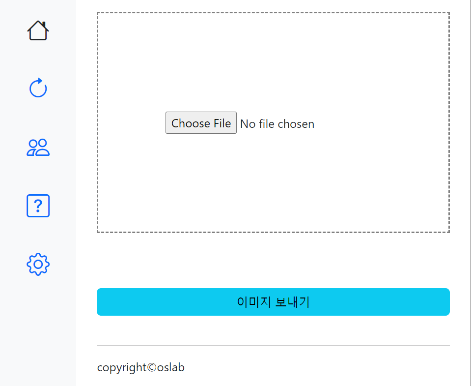
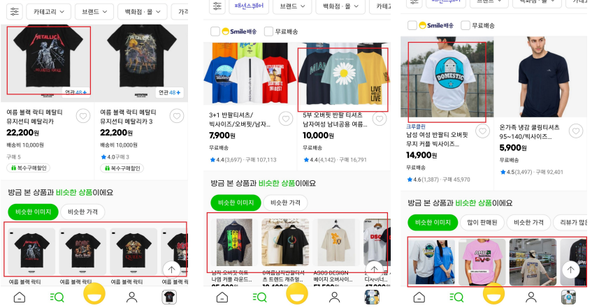
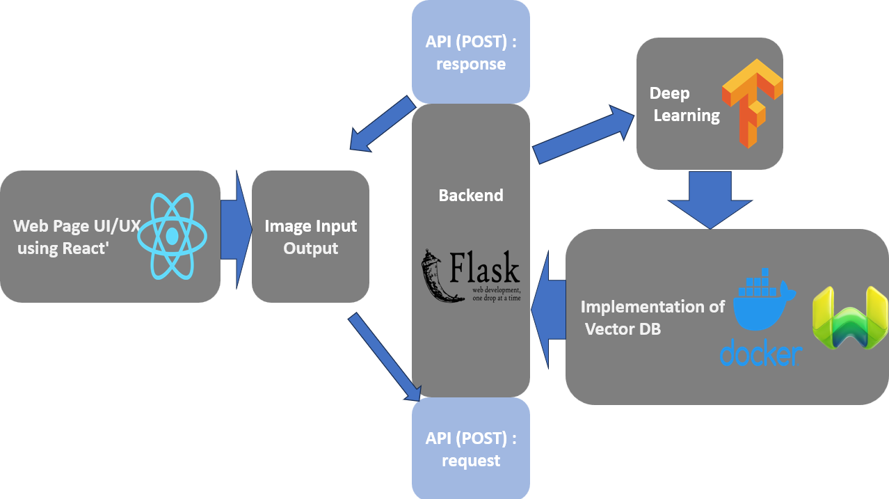

(<a href="https://github.com/Zolboo21/image-classification-website/blob/main/readmekr.md">한국어 버전으로 가기</a>)

<!-- INTRO -->

  
<h3 align="center">Similar Fashion Image Recommendation</h2>

  

    <a href="http://210.115.229.250:3000/#">Website</a>
    ·
    <a href="https://github.com/Zolboo21/image-classification-website/issues">Report Bug</a>
    ·
    <a href="https://github.com/Zolboo21/image-classification-website/blob/main/Team.md">Team members</a>
  

<!-- ############################################################# TABLE OF CONTENTS ################################################################## -->

  
Table of Contents

  <ol>
    <li>
      <a href="#project-overview">Project Overview</a>
    </li>
    <li>
      <a href="#project-architecture">Project Architecture</a>
    </li>
    <li>
      <a href="#technology-stack">Technology Stack</a>
    </li>
    <li>
      <a href="#implemented-features">Implemented Features</a>
    </li>
  </ol>

## Project Overview

  

  <strong>Enhance product discovery with visually similar fashion images.</strong>

Enhance product discovery with visually similar fashion images. The Similar Fashion Image Recommendation project utilizes advanced deep learning techniques, including CNN algorithms, to overcome the limitations of existing image classification methods. Our web-based system provides users with visually similar fashion images, revolutionizing the way products are discovered.

Inspired by the similar image recommendation feature in Gmarket, our project focuses on improving execution time, cost, and disk storage requirements. We employ a vector database to efficiently store and retrieve image features. Docker containerization ensures scalability and easy deployment across platforms.

The backend is built using Python Flask, providing a flexible and robust framework for API implementation. React powers the frontend, delivering an interactive and responsive user interface. Figma is used for design collaboration, ensuring a visually appealing and user-friendly experience.

Our system leverages TensorFlow, a powerful library for deep learning. We develop and fine-tune CNN models to achieve high accuracy in image classification. With our solution, users can effortlessly explore visually similar fashion images, enhancing their shopping experience.

### What is Similar Image Recommendation?

Gmarket App introduced the Similar Image Recommendation feature in May 2022. Instead of showing identical product images, this feature displays visually similar images to help users discover products more easily.

We aim to experiment with creating a closed-source similar image site to provide users with fast and easy access to visually similar fashion images.

## Project Architecture

  

## Technology Stack

- Front-end: [React](https://reactjs.org/) 
  - Web page UI
  - Interface implementation

- Front-end: [Figma](https://www.figma.com/) 
  - Web page UI design prototyping

- Back-end: [Flask](https://flask.palletsprojects.com/) 
  - API communication with the server

- Back-end: [Weaviate](https://www.semi.technology/developers/weaviate/current/) 
  - Storing image datasets in a vector space using Docker

- Back-end: [TensorFlow](https://www.tensorflow.org/) 
  - Training image datasets using the TensorFlow CNN model

- Docker 
  - Containerization for efficient deployment

### I. Back-end and API Communication

#### 1. Request Functions

    fetch('http://{HOST_IP_ADDRESS}:5000/process_image', {
      method: 'POST',
      body: data,
    })
      .then(response => response.json())
      .then(data => {
          setDivContent('');
          setProcessedData(data);
          setHideList(false);
      })
      .catch(error => {
        console.log('Error sending image: ', error);
      });

#### 2. Response Function
- Reads the data from the request's body, performs label prediction by passing the image data to the CNN model.

      @app.route("/process_image", method=["POST"])
        def process_image():
        uploaded_file = Image.open(request.files['filepath'].stream)   # request 이미지 파일
        setting = json.loads(request.form['setting'])                  # request 요청 값
        output_limit = setting['output_limit']                         # 최대 출력 갯수

        buffer = BytesIO()
        uploaded_file.save(buffer, format="JPEG")
        img_str = base64.b64encoded(buffer.getvalue()).decode()

        # TODO: cnn model to predict the breed of the closet image
        model_dir = "{HOST_ABSOLUTE_PATH}"
        model_filename = "{MODEL_FILE_NAME}.h5"
        model_path = os.path.join(model_dir, model_filename)

        model = tf.keras.models.load_model(os.path.abspath(model_path))    

        img = tf.keras.preprocessing.image.img_to_array(uploaded_file)
        img = tf.keras.applications.xception.preprocess_input(img)
        img = np.expand_dims(img, axis=0)
        preds = model.predict(img)                      # 모델 예측
        preds2 = np.squeeze(preds)
        predicted_class_index = np.argmax(preds2)
          ...
          ...
        weaviate_results = weaviate_img_search(img_str, label, label2, output_limit)

        results=[]
        for result in weaviate_results:
            results.append({
               "path": result["filepath"],
               "class": result["class"]   
         })

        return results 

#### 3. Vector Database
- Uses Weaviate's vector database to retrieve similar image results based on the input query image and labels.

      def weaviate_img_search(img_str, label, label2, output_limit=12):
          sourceImage = {"image": img_str}

          try:
              weaviate_results = client.query.get(
                  label, ["filepath", "class"]
              ).with_near_image(
                  sourceImage, encode=False
              ).with_limit(output_cnt).do()

              retyrb weaviate_results["data"]["Get"][label2]
          except KeyError:
              return []

#### 4. Server Configuration
- Follow the steps below to start the server:

  - Run Docker to execute Weaviate.

        docker compose up

  - Define the schema for image information.

        python create-schema.py

  - Convert all images to base64 format and import them into Weaviate.

        python images-to-base64.py

  - Upload the encoded images to Weaviate.

        python upload-data-objects.py

  - Run the server.

        python flask-app/application.py

---

